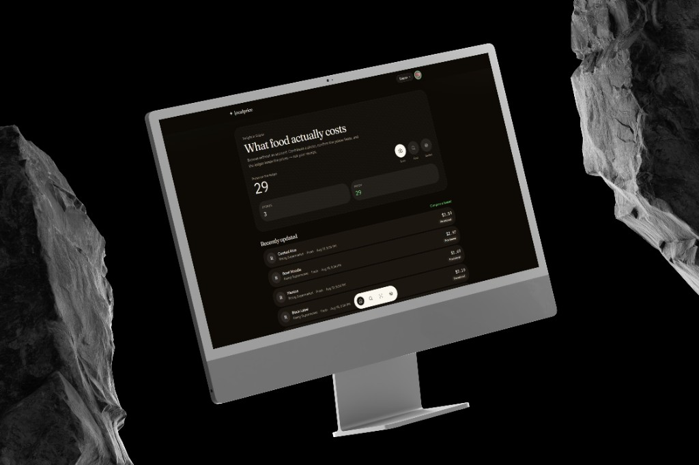
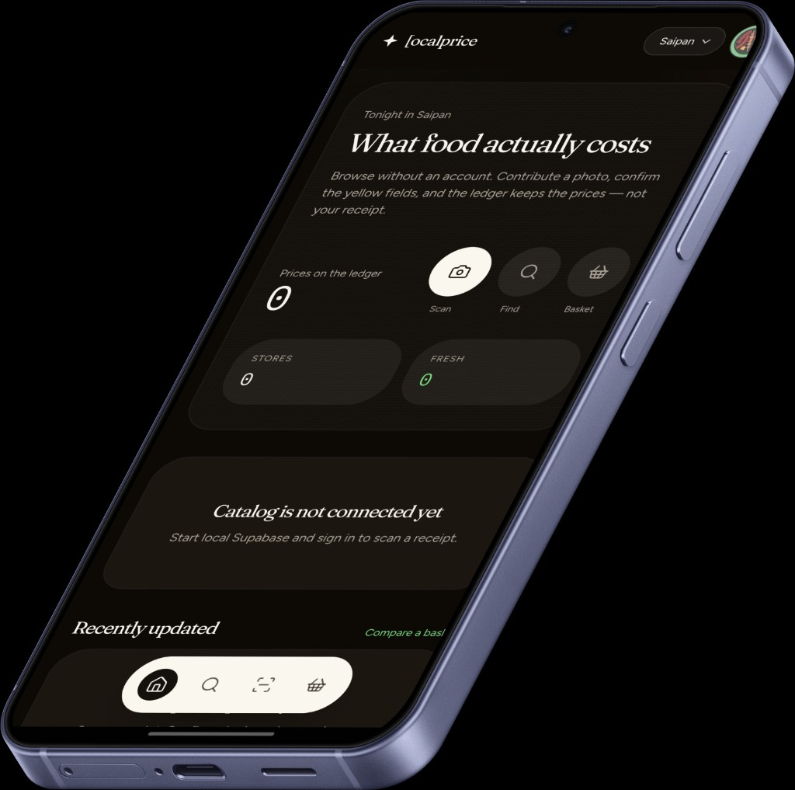
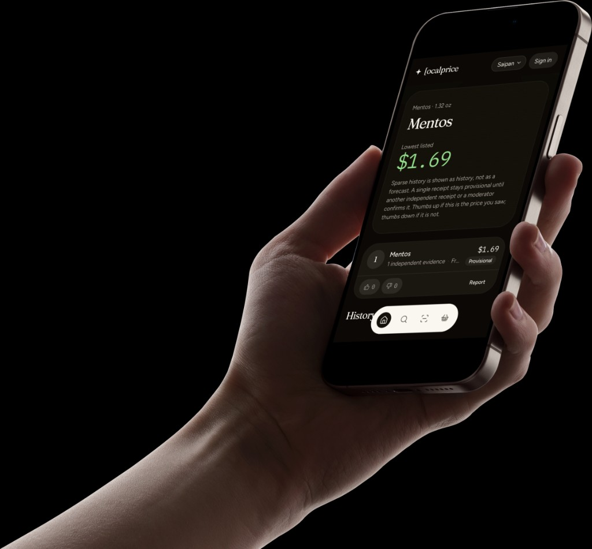

# LocalPrice

Community grocery prices, starting in Saipan. Photograph a receipt. The ledger keeps the price — not the paper.

**[Open the ledger](https://localprice.vercel.app)** · [Install the app](https://localprice.vercel.app/install)

<p align="center">
  
</p>

Browse without an account. Sign in with Google to contribute a photo, confirm the yellow fields, and publish prices to the board. Nobody configures Gemini, Google, or Supabase keys in the app.

<p align="center">
  
  &nbsp;&nbsp;
  
</p>

## How it works

1. A signed-in neighbor photographs a receipt they already have.
2. The server extracts line items. Uncertain fields stay yellow until the contributor confirms them.
3. Confirmed lines become append-only prices on the market board — provisional until another independent receipt or a moderator backs them up.
4. Anyone can browse, thumbs-up or thumbs-down a listing they did not submit, or report junk.

The receipt image is private, retained for a short window, then deleted. Structured prices stay.

## Stack

Next.js App Router, Supabase (Postgres, Auth, Storage), Gemini on the server, Vercel, and a Capacitor Android wrapper around the live site. Domain logic lives in TypeScript, not in the model prompt.

Receipt-to-structure is inspired by TaxHacker. The interface, database, verification, and community model are original.

## Develop locally

1. Install Node 22+ and Docker Desktop.
2. `copy .env.example .env.local`
3. `npx supabase start`, then copy the printed API URL, anon key, and service role key into `.env.local`. Leave `GEMINI_API_KEY` and `GOOGLE_PLACES_API_KEY` empty to use the mock extractor.
4. `npx supabase db reset` (migrations + Saipan seed)
5. `npm install` and `npm run dev`

Open [http://localhost:3000](http://localhost:3000). It redirects to `/m/saipan`. Magic links for local auth appear in Inbucket at [http://127.0.0.1:54324](http://127.0.0.1:54324).

```bash
npm run lint
npm run typecheck
npm test
npx playwright test
```

## Docs

- [Architecture](docs/architecture.md) — app layout, assignment, extraction
- [Privacy](docs/privacy.md) — what is stored and what is not
- [Retention](docs/retention.md) — receipt image window
- [Security](docs/security-checklist.md) — RLS, storage, service role
- [Cost controls](docs/cost-controls.md) — Gemini, Places, Vercel
- [Roadmap](docs/roadmap.md) — Saipan launch, then other markets

Production: same env vars on Vercel, Google redirect `https://<domain>/auth/callback`, cron routes protected with `CRON_SECRET`.
